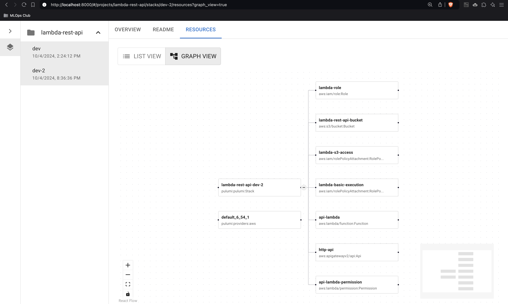

<p align="center">
    
    <h3 align="center">pulumi-ui</h3>
</p>

<p align="center">
  A UI to visualize Pulumi stacks in a <a href="https://www.pulumi.com/docs/concepts/state/">self-hosted state backend</a>.
</p>

<p align="center">
  <a href="https://opensource.org/licenses/Apache-2.0">
    
  </a>
  <!-- <a href="https://gitpod.io/#https://github.com/mlops-club/pyprojen">
    
  </a> -->
  <a href="https://www.pulumi.com/docs/">
    
  </a>
  <a href="https://github.com/mlops-club/pyprojen/commits/main">
    
  </a>
  
</p>

<br/>

## Overview

**TL;DR** The goal of this project is to make free self-hosting Pulumi at scale more viable for teams that do not need all of Pulumi Cloud's features.

The philosophical scope of this project includes tools, guides, or any resources that can help teams get the most **advanced, production-level experience** possible when self-hosting Pulumi--and to make this **simple**.



Pulumi is a great IaC tool. 

It's open source. It uses *real code* unlike Terraform and CloudFormation. It can deploy resources across multiple clouds, unlike AWS CDK.

However, coming from "free" IaC tools like CloudFormation and AWS CDK, Pulumi Cloud's pricing of $1.10/resource/mo for teams larger than 10 people can be a hard pill to swallow.

We support the company behind Pulumi. Pulumi leads the way in IaC innovation, and it takes money to do that. 

We view this project as a way to increase the size of the Pulumi community. 

If engineers can use this tool to find initial success self-hosting Pulumi, they will be better equipped to get approval from their procurement departments to buy Pulumi Cloud. Sometimes that requires more than 10 collaborators, more than 200 resources, etc.

## Quick start

### Launch the UI

Launch the UI using your Pulumi state backend. 

These examples assume your state is located in `~/.pulumi` which is the default location used when you run `pulumi login --local`.

With `pip`

```bash
pip install pulumi-ui
pulumi-ui up --state-uri file://~
```

With `uvx`

```bash
uvx pulumi-ui up --state-uri file://~
```

With `pipx`

```bash
pipx run pulumi-ui up --state-uri file://~
```

With `uv`

```bash
uv add pulumi-ui
pulumi-ui up --state-uri file://~
```

### Use a remote state backend

#### AWS S3 Bucket

`pulumi-ui` can pick up credentials from the environment, e.g. AWS profiles, IAM roles, etc.

Assuming you normally run `pulumi login s3://my-pulumi-state-bucket` to connect to your state backend, then run:

```bash
AWS_PROFILE=xxx pulumi-ui up --state-uri s3://my-pulumi-state-bucket
```

#### Google Cloud Storage

Assuming you normally run `pulumi login gs://my-pulumi-state-bucket` to connect to your state backend, then run:

```bash
GOOGLE_APPLICATION_CREDENTIALS=xxx pulumi-ui up --state-uri gs://my-pulumi-state-bucket
```

#### Azure Blob Storage

Assuming you normally run `pulumi login az://my-pulumi-state-account/my-pulumi-state-container` to connect to your state backend, then run:

```bash
AZURE_STORAGE_CONNECTION_STRING=xxx pulumi-ui up --state-uri az://my-pulumi-state-account/my-pulumi-state-container
```

## Contributing

See [CONTRIBUTING.md](./CONTRIBUTING.md)